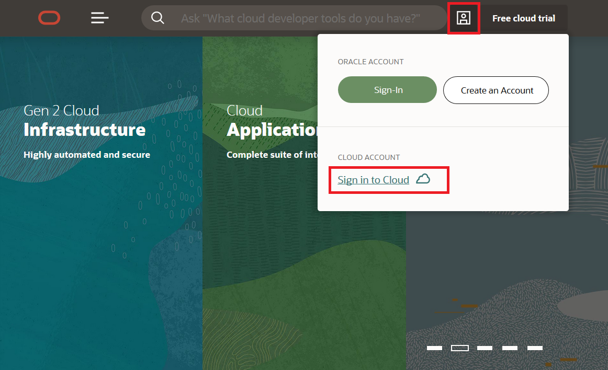

# Lab 0: Oracle Cloud Account and Kubernetes Cluster 

## Oracle Cloud Account 
This lab walks you through the steps of getting an Oracle Cloud Free Tier account and signing in. Next, you will use the account to create a Kubernetes cluster onto which we will install Linkerd. 

### What Do You Need? ###
* An email address
* Ability to receive SMS text verification (only if your email isn't recognized)


## Create Your Account ##
Make sure you registered at the front entrance. The email used during registration will be whitelisted and receive a Oracle Cloud promotion that does not require credit card information. 

1. Enter the appropriate information to create your account. 
     * Enter the same **email address** you used to register for Oracle Open World / Oracle Code One. A popup should appear recognizing your email. If not, the registration form will ask for additional information later.
     * Select your **country/territory**.
     * Click **Next**. 
2. Enter a few details for a new personal account. 
     * You can choose almost anything for your Cloud Account Name. Remember what you wrote. You'll need this name later to sign in.
     * Click **Enter Password**.  
3. If your email wasn't recognized or you're using a different email address, you'll need to provide additional information.
     * Provide a mobile number and click **Next: Verify Mobile Number**. In a few seconds, you should receive a verification code through SMS-text. Enter this code in the appropriate field and click **Verify**.
     * Click **Add Credit Card Details**. You will NOT be charged unless you elect to upgrade the account later. Enter the billing information, card details, and click **Finish**.
4. Validate your address.
5. Enter a password. Remeber this password so you can sign in to the Cloud later.
6. Click **Review Terms and Conditions**. Read and agree to the Terms & Conditions by checking the box and click **Complete Sign-Up**.
7. Your account is partitioning and should be available in a few seconds! When it's ready, you're automatically taken to a sign in page. You'll also receive a confirmation email containing sign in information.
8. Sign in to your Oracle Cloud account to start the lab. Your **user name** is your email address.

    

## Sign in to Your Account ##
If you've signed out of the Oracle Cloud, use these steps to sign back in.

1. Go to [cloud.oracle.com](https://cloud.oracle.com).
2. Click the **Profile Icon** to bring up a menu.
3. Click **Sign in to Cloud**.

    

4. Enter your Cloud Account Name and click **Next**. This is the name you chose while creating your account in the previous section. It's not your email address. If you've forgotten the name, see the confirmation email.

    

5. Enter your Cloud Account credentials and click **Sign In**. Your username is your email address. The password is what you chose when you signed up for an account.

    


## Kubernetes Cluster Creation 

1. Within the root compartment of your tenancy write the following policy statement to give Container Engine for Kubernetes access to resources in the tenancy: `Allow service OKE to manage all-resources in tenancy` See [Create Required Policy for Container Engine for Kubernetes](https://docs.cloud.oracle.com/iaas/Content/ContEng/Concepts/contengpolicyconfig.htm#PolicyPrerequisitesService). 

We will be creating a 'quick cluster' using default settings with new network resources as required. This approach is the fastest way to create a new cluster. If you accept all the default values, you can create a new cluster in just a few clicks. New network resources for the cluster are created automatically, along with a node pool and worker nodes. Note that worker nodes in a 'quick cluster' are created in private subnets, so a NAT gateway is also created (in addition to an internet gateway). 

2. Make sure you have a 

3. In the Console, open the navigation menu. Under **Solutions and Platform**, go to **Developer Services** and click **Container Clusters**.

4. Choose a **Compartment** you have permission to work in, and in which you want to create both the new cluster and the associated network resources.

5. On the **Cluster List** page, click **Create Cluster**.

6. Either just accept the default configuration details for the new cluster, or specify alternatives as follows: 

   - **Name:** The name of the new cluster. Either accept the default name or enter a name of your choice. Avoid entering confidential information.
   - **Kubernetes Version:** The version of Kubernetes to run on the master nodes and worker nodes of the cluster. Either accept the default version or select a version of your choice. Amongst other things, the Kubernetes version you select determines the default set of admission controllers that are turned on in the created cluster (the set follows the recommendation given in the [Kubernetes documentation](https://kubernetes.io/docs/admin/admission-controllers/#is-there-a-recommended-set-of-admission-controllers-to-use) for that version).

7. Select **Quick Create** to create a new cluster with default settings, along with new network resources for the new cluster. The **Create Virtual Cloud Network** panel shows the network resources that will be created for you by default. The **Create Node Pool** panel shows the fixed properties of the first node pool in the cluster that will be created for you: 

   - The name of the node pool (always pool1)
   - The compartment in which the node pool will be created (always the same as the one in which the new network resources will reside)
   - The version of Kubernetes that will run on each worker node in the node pool (always the same as the version specified for the master nodes)the image to use on each node in the node pool

8. The **Create Node Pool** panel also contains some node pool properties that you can change, but which have been given sensible defaults. Either just accept all the default configuration details and skip ahead to the next step to create the cluster immediately, or specify alternatives as follows: Either accept the default configuration details for the node pool, or specify alternatives in the Create Node Pool panel as follows: 

   - **Shape:** The shape to use for each node in the node pool. The shape determines the number of CPUs and the amount of memory allocated to each node. The list shows only those shapes available in your tenancy that are supported by Container Engine for Kubernetes.
   - **Quantity per Subnet:** The number of worker nodes to create for the node pool in each private subnet.
   - **Public SSH Key:** (Optional) The public key portion of the key pair you want to use for SSH access to each node in the node pool. The public key is installed on all worker nodes in the cluster. Note that if you don't specify a public SSH key, Container Engine for Kubernetes will provide one. However, since you won't have the corresponding private key, you will not have SSH access to the worker nodes. Note that because worker nodes in a 'quick cluster' are in private subnets, you cannot use SSH to access them directly (see [Connecting to Worker Nodes in Private Subnets Using SSH](https://docs.cloud.oracle.com/iaas/Content/ContEng/Tasks/contengconnectingworkernodesusingssh.htm#Connecti2)).
   - **Kubernetes Labels:** One or more labels (in addition to a default label) to add to worker nodes in the node pool to enable the targeting of workloads at specific node pools.

9. Either accept the defaults for the remaining cluster details, or specify alternatives in the **Additional Add Ons** panel as follows: 

   - **Kubernetes Dashboard Enabled:** Select if you want to use the Kubernetes Dashboard to deploy and troubleshoot containerized applications, and to manage Kubernetes resources. See [Starting the Kubernetes Dashboard](https://docs.cloud.oracle.com/iaas/Content/ContEng/Tasks/contengstartingk8sdashboard.htm).

   - **Tiller (Helm) Enabled:** Select if you want Tiller (the server portion of Helm) to run in the Kubernetes cluster. With Tiller running in the cluster, you can use Helm to manage Kubernetes resources.

10. Click **Create** to create the new network resources and the new cluster. Container Engine for Kubernetes starts creating the following resources:

    - the network resources (such as the VCN, internet gateway, NAT gateway, route tables, security lists, private subnets), named oke-<resource-type>-quick-<cluster-name>-<creation-date>

    - the cluster, with the name you specified
    - the node pool, named pool1
    - worker nodes, with names in the format `oke-c<part-of-cluster-OCID>-n<part-of-node-pool-OCID>-s<part-of-subnet-OCID>-<slot>`

    Note that if the cluster is not created successfully for some reason (for example, if you have insufficient permissions or if you've exceeded the cluster limit for the tenancy), any network resources created during the cluster creation process are not deleted automatically. You will have to manually delete any such unused network resources. Click **Close** to return to the Console.

11. Get the tenancy and user OCID's from the Console, which is located at [https://console.us-ashburn-1.oraclecloud.com](https://console.us-phoenix-1.oraclecloud.com/). Open the navigation menu, under Governance and Administration, go to **Administration** and click **Tenancy Details**. The tenancy OCID is shown under **Tenancy Information**. Click **Copy** to copy it to your clipboard. Get the user's OCID in the Console on the page showing the user's details. To get to that page: If you're signed in as the user: Open the User menu (User menu icon) and click User Settings.

12. Install the OCI CLI. To run the installer script, run the following command: 

    ```
    bash -c "$(curl -L https://raw.githubusercontent.com/oracle/oci-cli/master/scripts/install/install.sh)"
    ```

13. To have the CLI walk you through the first-time setup process, use:

    ```
    oci setup config
    ```

    The command prompts you for the information required for the config file and the API public/private keys. The setup dialog generates an API key pair and creates the config file. For more information refer to [Installing the CLI](<https://docs.cloud.oracle.com/iaas/Content/API/SDKDocs/cliinstall.htm>). 

14. Download kubeconfig. In the Console, open the navigation menu. Under Solutions and Platform, go to Developer Services and click Container Clusters. On the Cluster List page, click the name of the cluster you want to access using kubectl and the Kubernetes Dashboard. The Cluster page shows details of the cluster. Click the Access Kubeconfig button to display the How to Access Kubeconfig dialog box.Create a directory to contain the kubeconfig file. By default, the expected directory name is `$HOME/.kube`. For example, on Linux, enter the following command (or copy and paste it from the **How to Access Kubeconfig** dialog box):

    ```
    mkdir -p $HOME/.kube
    ```

15. Run the Oracle Cloud Infrastructure CLI command to download the kubeconfig file and save it in a location accessible to kubectl and the Kubernetes Dashboard. For example, on Linux, enter the following command (or copy and paste it from the **How to Access Kubeconfig** dialog box) where ocid1.cluster.oc1.phx.aaaaaaaaae... is the OCID of the current cluster. For convenience, the command in the **How to Access Kubeconfig** dialog box already includes the cluster's OCID: 

    ```
    oci ce cluster create-kubeconfig --cluster-id ocid1.cluster.oc1.phx.aaaaaaaaae... --file $HOME/.kube/config  --region us-phoenix-1
    ```

    Note that if a kubeconfig file already exists in the location you specify, details about the cluster will be added as a new context to the existing kubeconfig file. The `current-context:` element in the kubeconfig file will be set to point to the newly added context. 

16. Set the value of the KUBECONFIG environment variable to point to the name and location of the kubeconfig file. For example, on Linux, enter the following command (or copy and paste it from the **How to Access Kubeconfig** dialog box):

    ```
    export KUBECONFIG=$HOME/.kube/config
    ```

17. Test your kubeconfig and `kubectl` are configured correctly with:

    ```
    kubectl version
    ```

    Verify that kubectl can connect to the cluster with: 

    ```
    kubectl get nodes
    ```


## Additional Reading 


[Oracle Cloud Documentation](https://docs.cloud.oracle.com/iaas/Content/home.htm)

[Oracle Cloud Site](cloud.oracle.com)

[Oracle Kubernetes Engine](https://docs.cloud.oracle.com/iaas/Content/ContEng/Concepts/contengoverview.htm)
